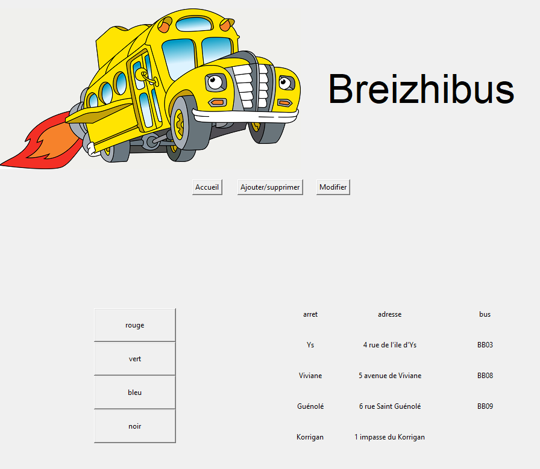
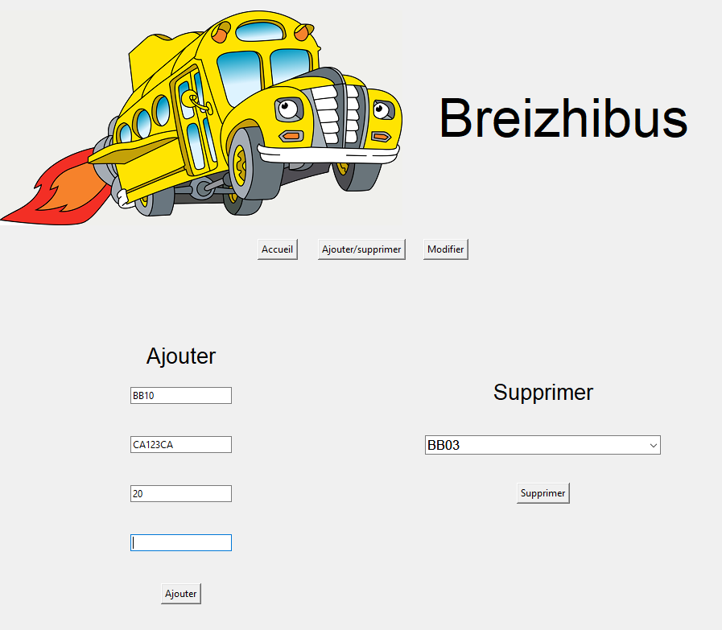
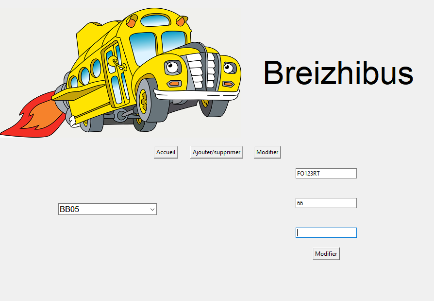

# Breizhibus

## Fonctionnement de l'appli

### Page d'accueil

Lorsque que l'on lance l'application on arrive sur la page d'accueil qui propose
- le header
  - le logo de l'appli
  - le nom de l'appli
  - un "menu" de bouton pour sélectionner la page que l'on veut
    - accueil
    - ajouter/supprimer
    - modifier
- le body
  - un espace d'affichage et de manipulation

Quand on clique sur le bouton d'une ligne (partie gauche), ça récupère et affiche les arrèts de cette ligne, leur adresse respective et les bus qui l'empruntent sous forme de tableau dans la partie droite.

 

### Page de ajout/suppression

En cliquant sur le bouton *ajouter/supprimer* on arrive sur la page susnommée. \n
Cette dernière propose sur la partie gauche l'interface d'ajout proposant des champs dans lesquels il faut renseigner les informations nécessaires à la création du bus (numéro, immatriculation, nombre de places et la ligne sur laquelle il tourne). \n
Sur la partie droite, on a l'interface de suppression qui propose un menu déroulant dans lequel on peut choisir le bus à supprimer 

 

### Page de modification

Cette page n'est pas encore tout à fait terminée. Malgré tout elle propose déjà sur la partie gauche un menu déroulant qui nous permet de choisir le bus à modifier et sur la partie droite les information sur ce bus que l'on veut remplacer (immatriculation, nombre de place, ligne)

 

## Choix techniques

Il reste encore quelques petites finitions comme un titre pour les pages d'accueil et de modification. De même, les pages d'ajout et modification peuvent être améliorées. 
## Difficulés rencontrées

J'ai rencontré pas mal de difficultés pour l'interface graphique car je n'en avais pas vraiment fait avant. Heureusement j'ai pu compter sur certaines personnes de la classe comme Thomas, Julien et Pereg.
